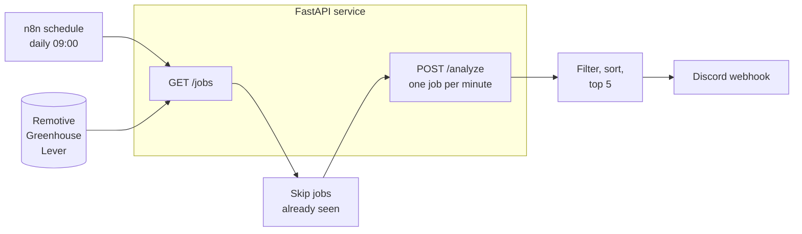

# AI Job Hunt Autopilot

An automated job-matching pipeline. Every morning an n8n workflow pulls AI/ML job listings from public job-board APIs, a FastAPI service scores each job against my resume with a hybrid semantic + keyword model, CrewAI agents explain the fit and draft an application email, and the best matches are posted to Discord.

It is built to be cheap to run: free public job APIs, a free Groq tier for the LLM, local embeddings, and everything runs on one Windows machine.

## How it works



1. **Fetch** (`GET /jobs`): pulls listings from Remotive, Greenhouse boards and Lever boards, keeps AI/ML/data titles in India or worldwide-remote locations, and drops senior or non-engineering titles (manager, director, sales, finance, senior, staff, principal, lead, and similar).
2. **Analyze** (`POST /analyze`), per job:
   - A CrewAI agent extracts the required skills and the minimum years of experience.
   - Jobs asking for more than 1 year of experience are filtered out (cheap early exit, no more LLM calls).
   - Python computes the score (see below).
   - A second agent explains the fit and skill gaps. If the score is 50 or higher, a third agent drafts a short application email.
3. **Notify**: n8n keeps jobs scoring 40 or higher, sorts them best first, and posts at most 5 per run to Discord. Every analyzed job is remembered for 60 days, so nothing is sent twice.

### Scoring

The final score is computed in Python, never by the LLM:

```
score = round(0.6 * semantic + 0.4 * keyword)
```

- **semantic** (0-100): cosine similarity between `all-MiniLM-L6-v2` embeddings of the resume and the job text.
- **keyword** (0-100): the share of the job's required skills that appear in the resume. Matching is case-insensitive, respects word boundaries (`Java` does not match `JavaScript`, `C++` works), and understands aliases (`JS` / `JavaScript`, `GenAI` / `Generative AI`, `Hugging Face` / `HuggingFace`, `GCP` / `Google Cloud`, and more).
- The matched skills and gaps shown in Discord come from this Python matcher, not from the LLM.

## Tech stack

| Layer | Tools |
|---|---|
| API | Python 3.12, FastAPI, Uvicorn, Pydantic v2 |
| LLM agents | CrewAI, LiteLLM, Groq (`openai/gpt-oss-120b`); Gemini is also configurable |
| Embeddings | sentence-transformers (`all-MiniLM-L6-v2`), runs locally |
| Orchestration | n8n (Docker), Discord webhook |
| Job sources | Remotive API, Greenhouse boards API, Lever postings API |
| Tests | pytest, no real LLM or network calls |

## Setup (Windows, PowerShell)

Requirements: Python 3.12, Docker Desktop, a free [Groq API key](https://console.groq.com), and a Discord webhook URL.

```powershell
git clone https://github.com/ShreyaSolanki17/job-hunt-autopilot.git
cd job-hunt-autopilot

python -m venv .venv
.\.venv\Scripts\Activate.ps1
pip install -r api\requirements.txt

Copy-Item .env.example .env
Copy-Item data\resume.sample.md data\resume.md
```

1. **Edit `.env`** (it is gitignored). See [Configuration](#configuration).
2. **Edit `data\resume.md`** and replace the sample with your own resume as plain text (it is gitignored too). Keep a clear Skills section with exact tool names, because the keyword score matches those words.

### Run the API

```powershell
cd api
uvicorn app.main:app --env-file ..\.env --host 0.0.0.0 --port 8000
```

`--host 0.0.0.0` lets the n8n container reach the API through `host.docker.internal`. Set `API_SHARED_SECRET` in `.env` so other machines on your network cannot call it. Start-up takes about 20 seconds because the LLM libraries and the embedding model load once, before any request. Interactive docs are at http://localhost:8000/docs.

### Run n8n

```powershell
docker compose up -d
```

Open http://localhost:5678 and create the local owner account. Then:

1. Import `n8n\workflow.json` (Workflows, then **Import from file**).
2. Press **Publish** so the daily 09:00 schedule (Asia/Kolkata) is active.

To try it immediately, press **Execute workflow**. A manual run does not record seen jobs, so you can repeat it.

For the daily run to happen, the PC must be on, Docker running, and the API process started.

## Configuration

All settings live in `.env` (see `.env.example`).

| Variable | Purpose |
|---|---|
| `GROQ_API_KEY` | Groq key for the default LLM |
| `GEMINI_API_KEY` | Optional alternative provider (default Gemini model is not verified yet) |
| `LLM_PROVIDER` | `groq` (default) or `gemini` |
| `LLM_MODEL` | Leave empty for the default, or a full id such as `groq/openai/gpt-oss-120b` |
| `API_SHARED_SECRET` | If set, every request needs the matching `X-API-Secret` header |
| `DISCORD_WEBHOOK_URL` | Where n8n posts matches |
| `API_URL` | How n8n reaches the API (default `http://host.docker.internal:8000`) |
| `RESUME_PATH` | Resume file, default `data/resume.md` (falls back to the sample) |
| `JOOBLE_API_KEY` | Reserved for a future Jooble source, unused today |

Docker Compose passes only `API_URL`, `API_SHARED_SECRET` and `DISCORD_WEBHOOK_URL` into n8n, so your LLM keys never enter the container.

### Tuning

| What | Where |
|---|---|
| Which job boards to read | `GREENHOUSE_BOARDS`, `LEVER_COMPANIES` in `api/app/sources.py` |
| Title allow and block lists, location rules | `TITLE`, `EXCLUDE`, `NEAR_ME` in `api/app/sources.py` |
| Maximum years of experience allowed | `MAX_YEARS_EXPERIENCE` in `api/app/crew.py` |
| Minimum score for an email draft | `EMAIL_MIN_SCORE` in `api/app/crew.py` |
| Notify threshold, top-N, jobs per run, retention | `MIN_SCORE`, `MAX_PER_RUN`, `MAX_ANALYZE`, `KEEP_DAYS` in the n8n Code nodes |
| Pace of LLM calls (Groq rate limit) | Batch interval on the `Analyze` node (60 s) |
| Skill aliases | `ALIAS_GROUPS` in `api/app/scoring.py` |

If you change the workflow in the n8n editor, download it and replace `n8n/workflow.json` so the repo stays in sync.

## API

| Method | Path | Description |
|---|---|---|
| GET | `/health` | Liveness check |
| GET | `/jobs` | Fetch and filter jobs from all sources |
| POST | `/score` | Score one job given its required skills (no LLM) |
| POST | `/analyze` | Full analysis: requirements, score, fit explanation, email draft |

`/jobs`, `/score` and `/analyze` require the `X-API-Secret` header when `API_SHARED_SECRET` is set.

## Tests

```powershell
python -m pytest -q
```

Tests never call a real LLM or external API. The LLM is injected as a function, so the tests replace it with canned answers, and job sources are tested against fake HTTP responses. The n8n Code nodes are plain JavaScript and were checked separately with stubbed n8n helpers.

## Project layout

```
api/
  app/
    main.py       FastAPI routes, auth, start-up warm-up
    schemas.py    Pydantic models and HTML-to-text cleaning
    scoring.py    Embeddings, keyword matching, final score
    crew.py       CrewAI agents, retries, experience filter
    sources.py    Remotive, Greenhouse and Lever fetchers and filters
  tests/
data/
  resume.sample.md   Tracked example; your real resume.md is gitignored
n8n/
  workflow.json      Exported n8n workflow
docker-compose.yml   n8n container
```

## Limits and notes

- **Free-tier pacing.** Groq's free tier allows about 8,000 tokens per minute, so jobs are analyzed one per minute and at most 15 per run.
- **Entry-level supply is thin.** Most AI/ML roles on these boards ask for several years of experience, so expect only a few matches a week with the 1-year limit. The limit and the board list are easy to change (see Tuning).
- **No scraping.** Only public job-board APIs are used. LinkedIn, Naukri and other sites that forbid scraping are intentionally not supported.
- **Remotive terms.** Remotive asks for attribution and at most about four requests a day. Discord messages for Remotive jobs link back and credit Remotive, and the workflow runs once a day.
- **LLM output.** Email drafts are generated from your resume and the job text. Read them before sending, because a model can occasionally overstate experience.
- **Groq quirk.** Groq sometimes rejects a correct structured answer with `tool_use_failed`. The service retries and, when possible, recovers the JSON from the error itself.
