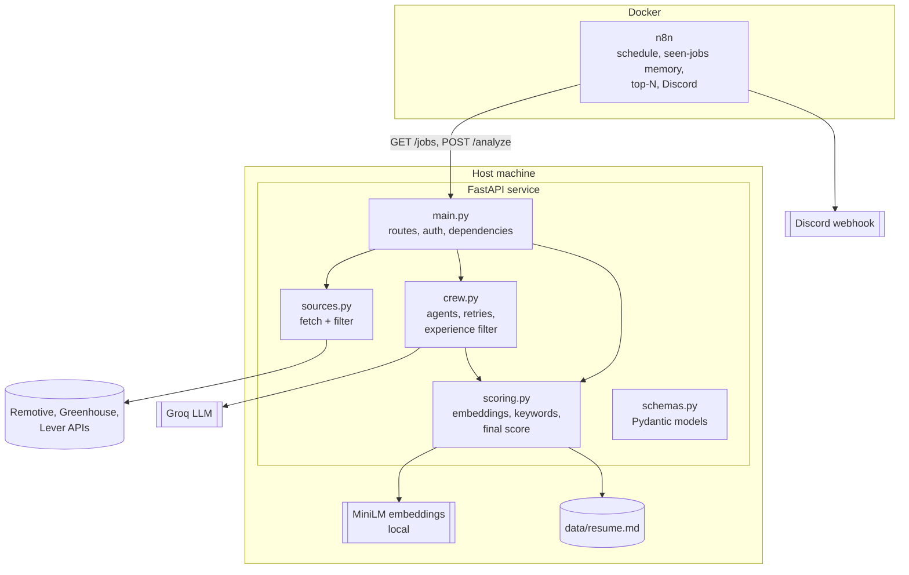
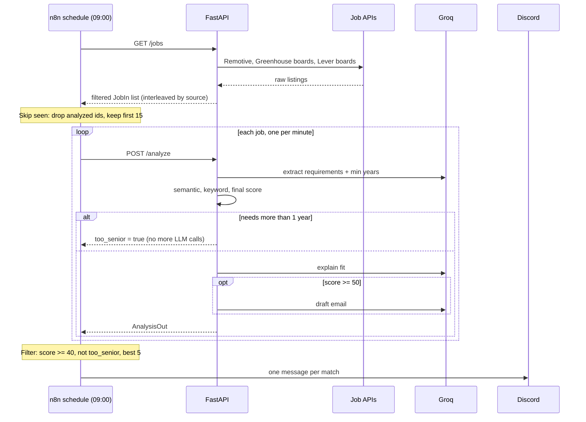

# Architecture

This document explains how the pipeline is put together and why. For setup and day-to-day use, see the [README](../README.md).

## Goals and constraints

- Find AI/ML jobs that fit one specific resume and tell me about the best ones each morning.
- Run on one Windows machine, on free tiers: public job-board APIs, Groq's free LLM tier, local embeddings.
- Keep the score explainable and deterministic. The LLM may explain a fit, but it never decides the number.
- Never call sites that forbid scraping, and keep secrets and the real resume out of git.

## System overview

Two processes cooperate. **n8n** owns scheduling, de-duplication and notification. A **FastAPI service** owns everything that needs code: fetching, scoring and the LLM work.



The split is deliberate. n8n is good at schedules, retries and "do this for each item", so none of that is hand-written. The Python service is easy to test, so all logic that can be wrong lives there.

## One run, end to end



## Components

### `schemas.py`: the contract

Pydantic models define every boundary: `JobIn` (a normalized job), `AnalysisOut` (the full result), `ScoreIn` and `ScoreOut`, and the three internal LLM output shapes `Requirements`, `FitExplanation` and `Email`.

- `JobIn.description` is cleaned in a validator: entity-escaped HTML (Greenhouse sends `&lt;div&gt;`) is unescaped, tags are removed, block tags become line breaks, and the text is capped at 8,000 characters. Every source therefore gets the same cleaning, and a new source cannot forget it.
- `AnalysisOut` rejects a result that has an email draft while `skipped_email` is true.
- `Requirements.min_years_experience` and `AnalysisOut.too_senior` carry the experience filter's outcome to n8n.

### `scoring.py`: deterministic scoring

```
score = round(0.6 * semantic + 0.4 * keyword)
```

- **Semantic:** cosine similarity of `all-MiniLM-L6-v2` embeddings for the resume and the job text, clamped to 0-1 and scaled to 0-100. The encoder is an injectable `Encoder` protocol, so tests pass a fake with preset vectors.
- **Keyword:** the share of required skills found in the resume. Matching uses custom boundaries, `(?<![\w+#])term(?![\w+#])`, so `C++`, `C#` and `node.js` match while `Java` does not match `JavaScript`. Skills are expanded through alias groups (`JS`/`JavaScript`, `GenAI`/`Generative AI`, `Hugging Face`/`HuggingFace`, and so on), so spelling differences do not create false gaps.
- `skill_matches` returns the matched and missing lists that appear in Discord. They come from this code, not from the LLM.

### `crew.py`: the LLM layer

`analyze()` is a plain function that takes a job, a resume, an encoder and a `run` callable. `run(role, prompt, schema)` returns a parsed Pydantic object. In production `run` is `run_task`, which builds a one-agent CrewAI crew with `output_pydantic`, so the model's answer is validated against the schema. In tests, `run` is a fake that returns canned objects. That single seam is why no test ever touches an LLM.

The steps:

1. **Requirements:** the agent returns short skill names and `min_years_experience`. The prompt forbids sentences in the skill lists, because a sentence can never match a resume.
2. **Scores:** computed in Python (see above).
3. **Experience gate:** if `min_years_experience` is above `MAX_YEARS_EXPERIENCE` (1), return early with `too_senior = true`. The fit and email steps are skipped, which saves most of the LLM cost for jobs that would be dropped anyway. The scores are still returned.
4. **Fit explanation:** two to three sentences on strengths and gaps.
5. **Email draft:** only when the score is at least `EMAIL_MIN_SCORE` (50).

Reliability measures live in this file:

- **`_retry`:** up to three attempts per LLM call.
- **`_recover`:** Groq sometimes rejects a correct structured answer with `tool_use_failed`, because the model wrote JSON as text instead of making a tool call. The valid JSON is inside the error's `failed_generation` field, so `_recover` validates it against the schema and uses it, with no extra call.
- **`warm_up`:** CrewAI imports LiteLLM lazily and the import takes about eight seconds. Two requests arriving during it raced and failed with `KeyError: 'litellm'`. The app now loads it once at start-up (FastAPI lifespan), together with the embedding model.

### `sources.py`: job ingestion

Each provider has one function that returns `JobIn` objects:

| Source | Endpoint | Notes |
|---|---|---|
| Remotive | `/api/remote-jobs?category=software-dev` | Full HTML descriptions. Terms require attribution and about four calls a day at most. |
| Greenhouse | `boards-api.greenhouse.io/v1/boards/<token>/jobs?content=true` | Entity-escaped HTML. Large boards return hundreds of jobs, so filtering must happen before the LLM. |
| Lever | `api.lever.co/v0/postings/<slug>?mode=json` | The description is the intro plus the `lists` sections, where requirements usually live. |

Filtering is applied per job, before any LLM call:

- **Title:** must match an AI/ML/data allow-list (`TITLE`) and must not match the block list (`EXCLUDE`: manager, director, head, VP, sales, finance, GTM, pre-sales, senior, Sr, staff, principal, lead).
- **Location:** must name India, an Indian city, APAC, Asia, worldwide or anywhere, or be a plain "Remote". Region-locked remotes such as "Remote - US" are rejected, because a block list of countries kept missing cities and states.

`fetch_all()` runs every source, logs and skips any source that raises, and interleaves the results round-robin so that a later cap spreads across companies instead of keeping only the first company's jobs.

### `main.py`: wiring

Routes are thin. Everything variable is a FastAPI dependency: `get_resume`, `get_encoder`, `get_runner`, `get_fetcher`. Tests swap them with `app.dependency_overrides`. `require_secret` checks the `X-API-Secret` header when `API_SHARED_SECRET` is set. The resume comes from `RESUME_PATH`, falling back to `data/resume.sample.md` on a fresh clone.

## The n8n workflow

`n8n/workflow.json` is a straight line of six nodes:

| Node | Role |
|---|---|
| `Daily` | Schedule trigger at 09:00, timezone Asia/Kolkata (set in `docker-compose.yml`). |
| `Get jobs` | `GET /jobs`, with a 180 s timeout and one retry. |
| `Skip seen` | Drops job ids already analyzed, then keeps the first 15 (`MAX_ANALYZE`). |
| `Analyze` | `POST /analyze`, one item at a time with 60 s between items, a 300 s timeout, one retry, and continue-on-error so one failure does not stop the run. |
| `Filter and format` | Keeps scores of 40 or more that are not `too_senior`, sorts best first, keeps the top 5 (`MAX_PER_RUN`), builds the message, and records ids as seen. |
| `Discord` | Posts each message to the webhook, 1.5 s apart. |

n8n runs each node over all items before the next node starts, so the Discord messages arrive together at the end of the run, not one by one.

### Seen-jobs memory

Analyzed job ids are stored in the workflow's static data (`$getWorkflowStaticData('global')`), which persists in n8n's database under `n8n_data/`. Ids expire after 60 days. Two rules protect against losing jobs:

- A failed analysis has no score, so it is **not** marked seen and is retried on the next run.
- A job that qualified but was cut by the top-5 cap is **not** marked seen, so a later run can still send it.

Static data is saved only for production executions of a published workflow. A manual **Execute workflow** click does not record seen jobs, which makes manual testing repeatable.

The cap of 15 is applied after the seen filter on purpose. An earlier version capped inside `/jobs`, before de-duplication, so after the first run the same 15 jobs came back, were all seen, and later jobs starved.

### Docker

`docker-compose.yml` runs n8n with `restart: unless-stopped`, stores data in `./n8n_data`, and passes in only `API_URL`, `API_SHARED_SECRET` and `DISCORD_WEBHOOK_URL`. The workflow reads them with `$env`, which needs `N8N_BLOCK_ENV_ACCESS_IN_NODE=false`. Because of this, no key lives in `workflow.json` and the LLM keys never enter the container. n8n reaches the API at `host.docker.internal:8000`, so uvicorn must listen on `0.0.0.0`.

## Failure modes

| What goes wrong | What happens |
|---|---|
| A job source is down or changes shape | That source is logged and skipped; the others still run. |
| Groq rate limit (about 8,000 tokens per minute) | Calls are paced at one job a minute; LiteLLM also retries with backoff. |
| `tool_use_failed` from Groq | Retried, and the valid JSON is recovered from the error when possible. |
| `/analyze` still fails | n8n continues, the job gets no score, is not marked seen, and is retried next run. |
| LLM invents a skill or an experience level | Skills and gaps shown come from the Python matcher. Email drafts can still embellish, so they must be read before sending. |
| The API is not running at 09:00 | The run fails and there is no catch-up; the next day's run proceeds normally. |
| Docker restarts | The n8n container restarts itself and the published schedule resumes. |
| PC is off or asleep at 09:00 | The run is skipped. |

## Security

- The shared secret is optional and compared as a plain string, which is adequate for a home network but not a hardened design. With `--host 0.0.0.0`, anyone on the LAN can reach the API, so the secret should be set.
- `.env` and `data/resume.md` are gitignored. Only `.env.example` (placeholders) and `data/resume.sample.md` are tracked.
- Only public job-board APIs are called. LinkedIn, Naukri and other sites that forbid scraping are out of scope by design.

## Testing

- Unit tests cover scoring (aliases, boundaries, the formula), schema validation and HTML cleaning, every source parser against fake HTTP responses, the experience gate, the retry and recovery helpers, and the API routes.
- No test calls a real LLM or network. The seams are the `Encoder`, the `run` callable, the fetch function and FastAPI dependency overrides.
- The JavaScript in the n8n Code nodes is not covered by the repository's automated tests. It was checked with a throwaway Node harness that stubs n8n's helpers, covering thresholds, the top-5 cap, seen-job rules and message length.

## Design decisions and trade-offs

- **n8n for orchestration.** Scheduling, per-item looping, retries and the webhook call come for free. The cost is a second runtime and a workflow whose logic sits in JSON, which is why the logic that matters stays in Python.
- **Python computes the score.** The same inputs always give the same number, which is easy to reason about and test. The LLM supplies requirements and prose only.
- **A narrow LLM seam.** Passing `run` into `analyze` made testing easy and keeps the option of replacing CrewAI open.
- **Filter early.** Title, location and experience filters run before the expensive steps, because the free LLM tier is the scarcest resource.
- **Seen memory in n8n, not in the API.** It is the least code. The trade-off is that it only persists for production runs and is tied to one n8n instance.

## Known limitations and possible next steps

- **CrewAI is used at its simplest:** one agent per task. A direct LiteLLM call with a Pydantic schema would remove a heavy dependency and its quirks, and the `run` seam makes that swap local to `crew.py`.
- **Entry-level supply is thin** on the chosen boards, and the 1-year limit removes most results. The limit and the board list are the main levers.
- **The API is a manually started process.** Starting it with Windows (Task Scheduler) would remove the main reason a day's run could silently fail.
- **Some aggregators (for example Jooble) return only short snippets**, which is too little text to score reliably, so none is used today. They would suit an unscored "discovery" feed.
- **Experience extraction depends on the model reading the posting correctly;** a missing or wrong number lets a job through or drops it.
